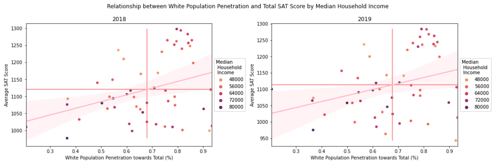

#  Project 1: Standardized Test Analysis

### Overview

The SAT and ACT are standardized tests that many colleges and universities in the United States require for their admissions process. This score is used along with other materials such as grade point average (GPA) and essay responses to determine whether or not a potential student will be accepted to the university.

Standardized tests have long been a controversial topic for students, administrators, and legislators. Since the 1940's, an increasing number of colleges have been using scores from students' performances on tests like the SAT and the ACT as a measure for college readiness and aptitude ([*source*](https://www.minotdailynews.com/news/local-news/2017/04/a-brief-history-of-the-sat-and-act/)). Supporters of these tests argue that these scores can be used as an objective measure to determine college admittance. Opponents of these tests claim that these tests are not accurate measures of students potential or ability and serve as an inequitable barrier to entry. In December of 2019, Public Counsel represented multiple students, nonprofit organizations and a Californian school district to sue the University of California Board of Regents on the basis that the use of SAT/ACT as a submission requirement is *["creating barriers to higher education for low-income students, students of color, and students with disabilities"](http://www.publiccounsel.org/stories?id=0283)*. Lately, more and more schools are opting to drop the SAT/ACT requirement for their Fall 2021 applications ([*read more about this here*](https://www.cnn.com/2020/04/14/us/coronavirus-colleges-sat-act-test-trnd/index.html)).

### Problem Statement

This project aims to explore the validity of [Public Counsel's Lawsuit](http://www.publiccounsel.org/tools/assets/files/1250.pdf), stating that *“ACT/SAT test score requirement discriminates against low-income, historically disenfranchised minority, and disabled undergraduate applicants”*, to help University X decide on whether or not they should drop SAT test scores as an admission requirement.

---

### Datasets

#### Dictionary

|Feature|Type|Dataset|Description|
|---|---|---|---|
|**state**|*string*|All|States in America + District of Columbia| 
|**sat_participation_2018**|*float*|sat_2018|Percent of students participating in SAT in 2018|
|**sat_ebrw_2018**|*integer*|sat_2018|Average Evidence-Based Reading and Writing scores in 2018|
|**sat_math_2018**|*integer*|sat_2018|Average Math scores in 2018|
|**total_sat_results_2018**|*integer*|sat_2018|Average total SAT score in 2018|
|**sat_participation_2019**|*float*|sat_2019|Percent of students participating in SAT in 2019|
|**sat_ebrw_2019**|*integer*|sat_2019|Average Evidence-Based Reading and Writing scores in 2019|
|**sat_math_2019**|*integer*|sat_2019|Average Math scores in 2019|
|**total_sat_results_2019**|*integer*|sat_2019|Average total SAT score in 2019|
|**median_income**|*integer*|household_median_income|American households' median income (Source: 2015-2019 American Community Survey 5-Year Estimates)|
|**white_pop_penetration_2018**|*float*|population_distribution_by_race_2018|Percent of the white population as percent of total population in 2018 (Source: KFF)|
|**black_pop_penetration_2018**|*float*|population_distribution_by_race_2018|Percent of the black population as percent of total population in 2018 (Source: KFF)|
|**hispanic_pop_penetration_2018**|*float*|population_distribution_by_race_2018|Percent of the hispanic population as percent of total population in 2018 (Source: KFF)|
|**asian_pop_penetration_2018**|*float*|population_distribution_by_race_2018|Percent of the Asian population as percent of total population in 2018 (Source: KFF)|
|**native_american_pop_penetration_2018**|*float*|population_distribution_by_race_2018|Percent of the Native American population as percent of total population in 2018 (Source: KFF)|
|**pacific_islander_pop_penetration_2018**|*float*|population_distribution_by_race_2018|Percent of the Pacific Islander population as percent of total population in 2018 (Source: KFF)|
|**multiple_races_pop_penetration_2018**|*float*|population_distribution_by_race_2018|Percent of mixed-race population as percent of total population in 2018 (Source: KFF)|
|**total_population_2018**|*integer*|population_distribution_by_race_2018|Total population in 2018 rounded to the nearest 100 (Source: KFF)|
|**white_pop_penetration_2019**|*float*|population_distribution_by_race_2019|Percent of the white population as percent of total population in 2019 (Source: KFF)|
|**black_pop_penetration_2019**|*float*|population_distribution_by_race_2019|Percent of the black population as percent of total population in 2019 (Source: KFF)|
|**hispanic_pop_penetration_2019**|*float*|population_distribution_by_race_2019|Percent of the hispanic population as percent of total population in 2019 (Source: KFF)|
|**asian_pop_penetration_2019**|*float*|population_distribution_by_race_2019|Percent of the Asian population as percent of total population in 2019 (Source: KFF)|
|**native_american_pop_penetration_2019**|*float*|population_distribution_by_race_2019|Percent of the Native American population as percent of total population in 2019 (Source: KFF)|
|**pacific_islander_pop_penetration_2019**|*float*|population_distribution_by_race_2019|Percent of the Pacific Islander population as percent of total population in 2019 (Source: KFF)|
|**multiple_races_pop_penetration_2019**|*float*|population_distribution_by_race_2019|Percent of mixed-race population as percent of total population in 2019 (Source: KFF)|
|**total_population_2019**|*integer*|population_distribution_by_race_2019|Total population in 2019 rounded to the nearest 100 (Source: KFF)||

#### Provided Data

* [`sat_2018.csv`](./data/sat_2018.csv): 2018 SAT Scores by State ([source](https://blog.collegevine.com/here-are-the-average-sat-scores-by-state/))
* [`sat_2019.csv`](./data/sat_2019.csv): 2019 SAT Scores by State ([source](https://blog.prepscholar.com/average-sat-scores-by-state-most-recent))

#### Additional Data
* [Household Median Income by State](https://www.census.gov/search-results.html?q=average+per+capita+income&search.x=0&search.y=0&search=submit&page=1&stateGeo=none&searchtype=web&cssp=SERP)
* [Population Distribution by Race](https://www.kff.org/other/state-indicator/distribution-by-raceethnicity/?currentTimeframe=0&sortModel=%7B%22colId%22:%22Location%22,%22sort%22:%22asc%22%7D)

---

### Summary of Findings

After cleaning and merging the above datasets, below are the key findings:

*Figure_1*

Positive correlation can be seen between Average SAT Score and White Population Penetration towards the Total Population, with a correlation coefficient of 34% and 31% in 2018 and 2019, respectively. However, the relationship between median household income and white population penetration is unclear when looking at the colored clusters.  

*Figure_2*

Looking at the scatter plots in Figure_2, it can be observed that there is little to no correlation between average SAT Score and Median Household Income. However, a cluster of states with a relatively large penetration of white population recieving high marks can be spotted - proving the previous notion above (Figure_1) and showing the positive correlation between having a larger penetration of white population and higher test scores. 

*Figure_3*

When we analyse the relationship between average SAT scores and participation rates, however, we can see a clear negative correlation, with a correlation coefficient of -79% in 2018 and -86% in 2019. This may be due to the fact that lower SAT participation means a smaller sample size and being that there are two forms of standardized testing, it could be assumed that students who chose to do the SAT instead of the ACT made the concious and active decision to do so and therefore are more likely to have studied more extensively for it. Higher SAT participation means the range of students' academic capabilities are wider, dragging down the mean score of those states.

Due to the fact that there are differing sample sizes of scores making up the average SAT score per state, and being that median household income represents close to 100% of the states' population, in order for the correlation to be better observed, participation rate is filtered to show correlation when participation is below Q1, within IQR and above Q3.

*Figure_4*

Once participation is filtered above the 75th percentile, it can be observed that there is a positive correlation between median income and average SAT score, with a correlation coefficient of 45% in 2018 and 48% in 2019. We can also observe that most states within this cohort has over 50% penetration of white population towards total.

*Figure_5*

*Figure_6*

Looking at the correlation when filtering participation by its IQR and 25th percentiles, most plot show a very small negative correlation (as a result of smaller sample sizes). With the exception of 2019 for states with participation below Q1 at 5.5%, in which penetration of white population within the cohort is high. 

---

### Conclusion and Recommendation

This report suggests that there are slight positive correlations between SAT Scores and:

1. Household Income in states with participation rates higher than 77.5% in 2018 and 82% in 2019;
2. and White Population Penetration towards total Population.

This confirms the basis behind Public Counsel's lawsuit and it is recommended for University X to drop the use of SAT test scores as an admission requirement.

If the analysis were to be repeated, data points should be collected from the same population sample (instead of 3 separate contexts of aggregated data) so that correlation / relationship between each factor (score, household income and race) may be clearer and more precise. 

